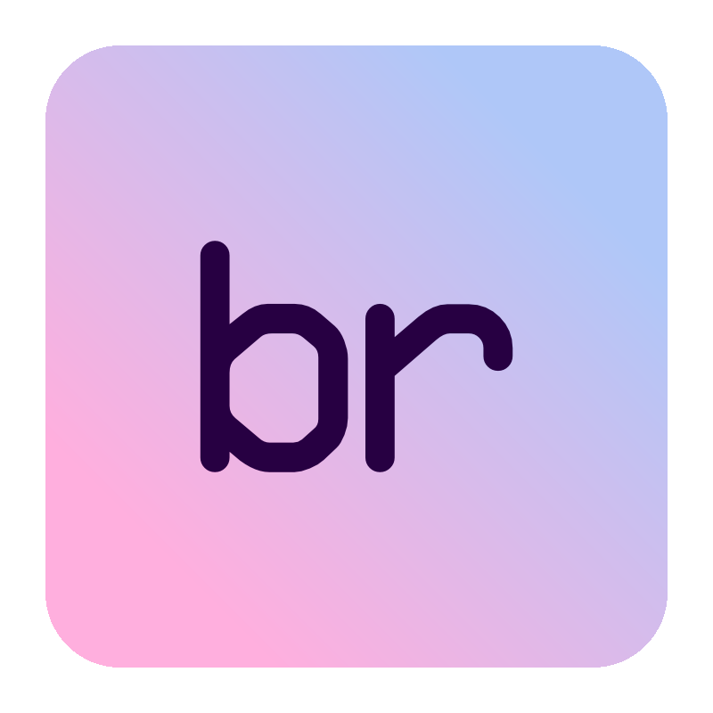

<div align="center">
	
	<h1>📖 Bond Reader - Utility to parse Microsoft Bond files</h1>
	<p>
		<b>Easily analyze Bond files without writing custom code.</b>
	</p>
	<br>
	<br>
	<br>
</div>

I've spent enough time looking at `application/x-bond-compact-binary` files [returned by Halo Infinite API](https://den.dev/blog/parsing-halo-api-bond/), that I thought I'd save myself and others the hassle of reading those manually for quick structural checks. This utility doesn't do much other than output the structure of Bond-encoded files - you still need to do the hard work of converting them to some kind of strongly-type representation, at least for now.

## Getting Started

Download one of the [available releases](https://github.com/dend/bond-reader/releases) and extract the archive. Look for `br.exe` or `br` in the folder - that's what you need to read Bond files.

This tool can **only read files encoded in Bond format** without any additional "wrappers". That is, if the content is wrapped in something else, or is `zlib`-ed (as an example), you'll need to first clean that up before passing it to `br`.

## Usage

```
Usage:
  br [command] [options]

Options:
  --version       Show version information
  -?, -h, --help  Show help and usage information

Commands:
  parse  Parses a Bond file and outputs its structure.
```

An example command could be something like:

```bash
br.exe parse --version 2 --input "C:\example.bin" --output test.txt
```

If you don't specify the output file, you'll only see the structure output to the console.

## Feedback

[Open an issue](https://github.com/dend/bond-reader/issues).
